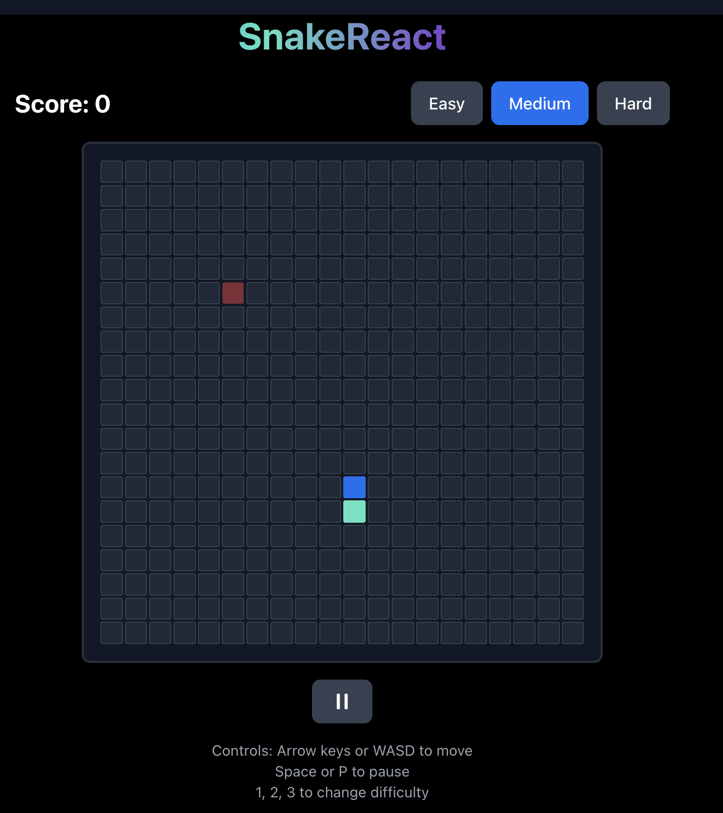
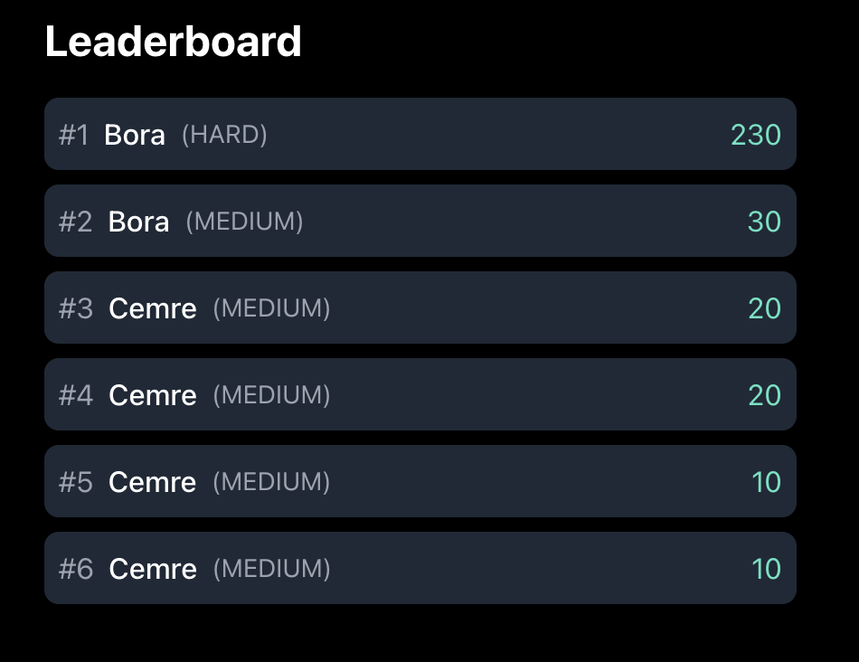

# React Snake Game 🐍

A modern, feature-rich Snake game built with React, TypeScript, and Tailwind CSS. Inspired by Vercel's design aesthetic, this game includes power-ups, achievements, and a leaderboard system.

## Screenshots


_Game in action with power-ups and achievements_


_Leaderboard showing top scores_

## Features

### Core Gameplay

- Classic Snake gameplay with smooth controls
- Wall wrapping (snake continues on the opposite side)
- Responsive design that works on both desktop and mobile
- Pause functionality
- Retro sound effects

### Power-ups

- 🚀 **Speed Boost**: Makes the snake move faster for 5 seconds
- 🐌 **Slow Motion**: Slows down the snake for 5 seconds
- 💎 **Points Multiplier**: Instantly adds 50 points
- 👻 **Ghost Mode**: Allows passing through yourself for 5 seconds

### Difficulty Levels

- **Easy**: Slower speed, fewer power-ups
- **Medium**: Balanced speed and power-up frequency
- **Hard**: Faster speed, more power-ups

### Achievements

- 🩸 **First Blood**: Score your first point
- 👑 **Snake Master**: Reach a score of 100
- ⚡ **Speed Demon**: Collect 3 speed power-ups
- 👻 **Ghost Rider**: Use ghost mode to pass through yourself

### Leaderboard

- Tracks top 10 scores
- Records difficulty level
- Persists scores in local storage

## Controls

### Keyboard

- Arrow keys or WASD to move
- Space or P to pause
- 1, 2, 3 to change difficulty (Easy, Medium, Hard)

### Mobile

- Touch-friendly interface
- Responsive design
- Prevents unwanted scrolling

## Technologies Used

- React 18
- TypeScript
- Vite
- Tailwind CSS
- use-sound for audio effects
- @vercel/analytics for analytics
- @headlessui/react for UI components
- @heroicons/react for icons

## Getting Started

1. Clone the repository:

```bash
git clone https://github.com/yourusername/react-snake.git
cd react-snake
```

2. Install dependencies:

```bash
npm install
```

3. Start the development server:

```bash
npm run dev
```

4. Open [http://localhost:5173](http://localhost:5173) in your browser.

## Building for Production

```bash
npm run build
```

The built files will be in the `dist` directory.

## Contributing

Contributions are welcome! Please feel free to submit a Pull Request.

## License

This project is licensed under the MIT License - see the [LICENSE](LICENSE) file for details.

## Acknowledgments

- Inspired by Vercel's design aesthetic
- Built with modern web technologies
- Special thanks to the React and Tailwind CSS communities
